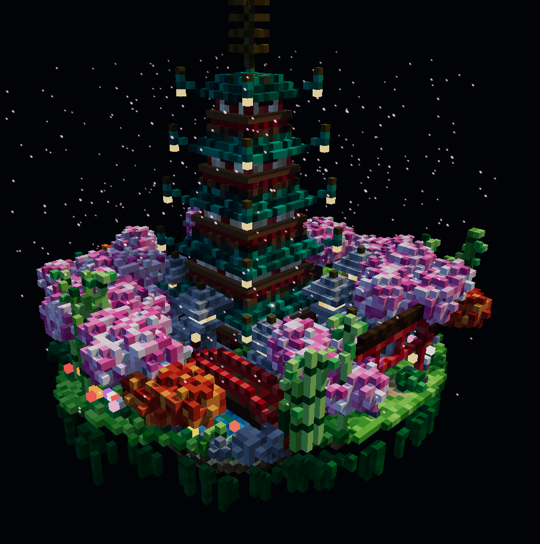

## Setup in simple terms
- install [obscura](https://github.com/h4ckf0r0day/obscura/releases) (no-render stealth is the one i use)
- install the newest [release](https://github.com/gyatstian/deepseaport/releases) (TIP: CLICK THE BLUE TEXT)
- place obscura and deepseaport next to eachother or put obscura in PATH
- open deepseaport, add account(s) and then start server.
- *optionally play around with settings or/and config.json!*
- base url: http://127.0.0.1:5001/v1

# notice
- deepseek on the website feels lobotomized/lazy, though it's not that bad, and you can definitely make it much better with skills or good prompting. below inside the readme I added a voxel pagoda he made<br>
- tool calling seems ok. most often fails on long/complicated ones so advise him to implement one by one and it will be ok<br>
- app needs https://aka.ms/vs/17/release/vc_redist.x64.exe beacuse of obscura

# deepseaport — DeepSeek web2api (Obscura-backed)

Unofficial, research-only bridge: exposes `chat.deepseek.com` web chat as an
OpenAI-compatible API (`/v1/chat/completions`, streaming + `tools`).

How it works:

- **Obscura** (`h4ckf0r0day/obscura` headless browser) owns a persistent
  profile that solves the AWS WAF JavaScript challenge and holds the
  `aws-waf-token` cookie. All DeepSeek HTTP calls replay that cookie jar,
  with a browser User-Agent captured from the same engine.
- Hot path is direct HTTP (`curl_cffi`, Chrome TLS impersonation):
  login → create session → PoW challenge (`DeepSeekHashV1` wasm) →
  `POST /api/v0/chat/completion` (SSE `p`/`v` events) → delete session.
- No DOM driving per token: fast enough for agentic loops.

Agentic-harness support:

- Full OpenAI `tools` schema in, `tool_calls` out (stream + non-stream),
  parallel calls, stable `call_xxx` ids, `finish_reason: "tool_calls"`.
- `role: tool` results are folded back into the web prompt, so multi-step
  tool loops work against a model with no native function calling.
- One in-flight stream per account (DeepSeek limitation) enforced with
  per-account locks + rotation; auto session cleanup; PoW/WAF retry once.

## Quickstart
**Setup for both:**
Obscura binary (`h4ckf0r0day/obscura`, i personally use no-render stealth): drop
`obscura.exe` next to `config.json` (or under `bin/`, `tools/`,
`vendor/`, `obscura-*/`), or set `obscura_bin` / `OBSCURA_BIN`. path also works.

**A. exe:**
- just run the .exe from the releases

**B. python:**
```powershell
pip install -e .
python -m deepseaport login --email you@x.com  # browser login via Obscura, saves token
python -m deepseaport waf                      # verify Obscura + WAF cookie
python -m deepseaport serve                    # :5001
```


```powershell
curl http://127.0.0.1:5001/v1/models
curl -N http://127.0.0.1:5001/v1/chat/completions `
  -H "Content-Type: application/json" `
  -d '{"model":"deepseek-flash","messages":[{"role":"user","content":"hi"}],"stream":true}'
```

## Showcase
**prompt used (inside opencode with a short but sharp agent):** Design and create a very creative, elaborate, and detailed voxel art scene of a pagoda in a beautiful garden with trees, including some cherry blossoms. Make the scene impressive and varied and use colorful voxels. Use whatever libraries to get this done but make sure I can paste it all into a single HTML file and open it in Chrome.<br>

<div align="center">
  
</div>

**my opnion:** it looks better than v4 definetly as it has more details but looks much worse than what an actual flash v4.1 can create. it seemed like he just rushed to create it (didn't think about correcting any mistakes after finishing or adding anything further).

## Config

`config.json` (or env, see `.env.example`):

```json
{
  "keys": ["sk-local-dev"],
  "accounts": [{ "email": "you@x.com", "password": "...", "token": "" }],
  "active_account": "",
  "obscura_bin": "",
  "obscura_profile": "",
  "port": 5001,
  "listen": false,
  "chat_model": "deepseek-flash"
}
```

`active_account` is the `CURRENT` selection (`""` = auto-failover over the
whole pool). `chat_model` remembers the last `/model` pick from server-with-chat
mode (env: `DEEPSEAPORT_CHAT_MODEL`). All remaining behaviour flags
(`enable_tools`, `warmup_on_startup`, `auto_delete_session`, `max_retries`,
`parallel_challenge_fetch`, `use_multiple_accounts`, `log_level`,
`stream_mode`) live in `config.example.json` and are editable from the
TUI Settings screen.

`use_multiple_accounts` (default `true`, env:
`DEEPSEAPORT_USE_MULTIPLE_ACCOUNTS`): when `true` and `CURRENT` is busy
(one in-flight stream per account, enforced by per-account lock) or cooling
down (banned), the request fails over to another healthy account — this is
what lets parallel subagents / multitasking share one instance. When
`false`, requests stick to `CURRENT` and queue on it instead.

`"listen": true` serves on `0.0.0.0` (LAN-visible); default `false` binds
`127.0.0.1` only. `--host` flag overrides both.

You can skip email/password by pasting a `userToken` from a logged-in
browser (localStorage) into `accounts[].token`.

## Endpoints

- `GET /health`, `GET /v1/models`, `POST /v1/chat/completions`
- `GET /v1/waf/status` — Obscura binary, profile, WAF cookie state

Models: `deepseek-flash`, `deepseek-flash-reasoner`,
`deepseek-flash-search`, `deepseek-flash-reasoner-search`.
Reasoner models return `reasoning_content` alongside `content`.

See [ARCHITECTURE.md](ARCHITECTURE.md) for protocol details, auth/PoW/SSE
notes, and the tool-calling design.

## Disclaimer

This is an independent educational/experimental project. 
Use of this project is at your own risk, and users are responsible for complying with all relevant terms and laws. 
It is provided as-is, without warranties.
Unofficial reverse engineering for personal research. Respect DeepSeek's
Terms of Service; web sessions can break or be rate-limited at any time.
Prefer the official `platform.deepseek.com` API for production.
